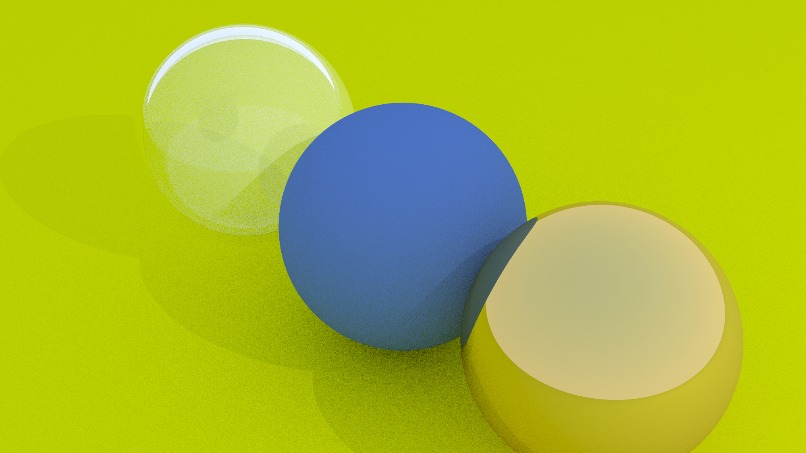

# Simple Physically-Based Ray Tracer (Python)

This repository contains a compact, educational, physically-based ray tracer
implemented in pure Python. It's intentionally focused on mathematical
correctness and clarity rather than performance.
<br>

<br>
Contents
- `vec3.py`: vector math utilities (Vec3) with reflection/refraction helpers
- `ray.py`: Ray class (origin + direction * t)
- `hittable.py`: `Sphere` and intersection math
- `hittable_list.py`: scene object container
- `material.py`: `Lambertian`, `Metal`, `Dielectric` (Snell + Schlick)
- `camera.py`: perspective camera with `lookfrom`, `lookat`, `vup`, and FOV
- `scene.py`: simple demo scene builder and point-light container
- `main.py`: renderer and CLI driver (writes PPM, optionally PNG)

Features
- Perspective camera with configurable field of view
- Correct ray-sphere intersection and surface normals
- Lambertian diffuse using cosine-weighted hemisphere sampling
- Metallic reflection with adjustable roughness (fuzz)
- Dielectric materials using Snell's Law, total internal reflection,
    and Fresnel via the Schlick approximation
- Point lights with shadow rays for direct illumination
- Recursive path tracing-style indirect lighting (depth-limited)
- Multisample anti-aliasing and gamma correction

Quick start

1. (Optional) install Pillow for PNG output:

```powershell
pip install Pillow
```

2. Run the renderer (quick default settings):

```powershell
C:\Users\Rudolf\AppData\Local\Programs\Python\Python314\python.exe C:\workspace\main.py
```

This writes `render.ppm` and, if Pillow is installed, `render.png`.

CLI options
- `--width`: image width in pixels (default 200)
- `--samples`: samples per pixel (default 20)
- `--depth`: max ray bounce depth (default 10)
- `--out`: output file prefix (default `render` → `render.ppm` / `render.png`)

Notes on the implementation
- Diffuse (Lambertian) scattering uses cosine-weighted hemisphere sampling for
    physically-plausible energy distribution (importance sampling).
- Metal reflection is implemented by reflecting the incoming ray about the
    surface normal, with a small random ``fuzz`` term to simulate roughness.
- Dielectric materials compute refraction using Snell's Law. When refraction is
    not possible (total internal reflection), the ray is reflected. Fresnel
    reflectance is approximated using the Schlick approximation.
# Simple Physically-Based Ray Tracer (Python)


This is a compact, educational ray tracer implemented in pure Python. It
focuses on clarity and correctness over performance — a learning project to
teach the fundamentals of ray tracing: rays, intersections, materials,
and a simple camera.

What is a ray tracer?
----------------------

A ray tracer is a program that creates images by simulating how light travels.
Imagine the camera as an eye: for each pixel the tracer sends one or more
rays into the scene to see what they hit. When a ray hits a surface, the
renderer computes how that surface interacts with light — whether the light
is absorbed, scattered (diffuse), reflected (mirror-like), or bent
(refracted). By sending many rays per pixel and allowing rays to bounce,
the tracer builds up realistic lighting, shadows, reflections, and
transparent effects. This repository implements those basics using simple
sphere geometry and three material models (diffuse, metal, dielectric), and
uses recursive sampling to approximate indirect illumination.

Project overview
----------------

- `main.py` — CLI renderer. Produces `render.ppm` (ASCII PPM). If Pillow is
    installed the script also saves `render.png`.
- `vec3.py` — 3D vector helpers and random sampling routines.
- `ray.py` — Ray class (origin + direction parameterized by `t`).
- `hittable.py` — Sphere geometry and intersection logic.
- `hittable_list.py` — Scene container that aggregates hittable objects.
- `material.py` — `Lambertian`, `Metal`, `Dielectric` material models.
- `camera.py` — Simple perspective camera with `lookfrom`, `lookat`, FOV.
- `scene.py` — Small example scene builder used by `main.py`.
- `visualize.py` — Utility to analyze rendered images (e.g., luminance
    histogram).

Quick setup
-----------

1. Create a virtual environment (recommended):

```powershell
python -m venv .venv
.venv\Scripts\activate
```

2. Install optional dependencies (Pillow for PNG output, matplotlib for
     visualization):

```powershell
pip install -r requirements.txt
```

Rendering an image
------------------

Run the renderer with default settings:

```powershell
python main.py
```

Output files:
- `render.ppm` — ASCII PPM image produced by the renderer.
- `render.png` — PNG version produced when Pillow is installed. If you do
    not see `render.png`, you can convert `render.ppm` to PNG using the helper
    `convert_ppm_to_png.py` included in this repository:

```powershell
python convert_ppm_to_png.py render.ppm render.png
```

CLI options (supported by `main.py`)
- `--width` — image width in pixels (default 200)
- `--samples` — samples per pixel (default 20)
- `--depth` — recursion depth / max bounces (default 10)
- `--out` — output file prefix (default `render`, producing `render.ppm` / `render.png`)

Notes on how the code works
--------------------------

- For each pixel the renderer performs multiple random samples (antialiasing)
    and averages the results. Each sample spawns a primary ray from the
    camera.
- Intersections are computed per-object (sphere math in `hittable.py`). If a
    hit occurs, the material determines whether a scattered ray is spawned
    (diffuse bounce, reflection, or refraction) and returns an attenuation
    color.
- The renderer accumulates radiance recursively until the bounce `depth`
    limit is reached or no further scattering occurs.

Generating the demonstration image
----------------------------------

The repository includes `render.png` in the README as an example. If you do
not have `render.png` in your working directory, run the renderer to produce
`render.ppm`, then convert it using `convert_ppm_to_png.py`.

Extending the tracer
--------------------

- Add new geometry by implementing the `Hittable` interface used by
    `hittable_list.py`.
- Implement textured materials by modifying albedo per-hit point.
- Replace point lights with emissive area lights for softer shadows.

Helper: PPM → PNG converter
---------------------------

Use `convert_ppm_to_png.py render.ppm render.png` to create a PNG when
Pillow is available.

License
-------

Provided for educational purposes. No license attached.

